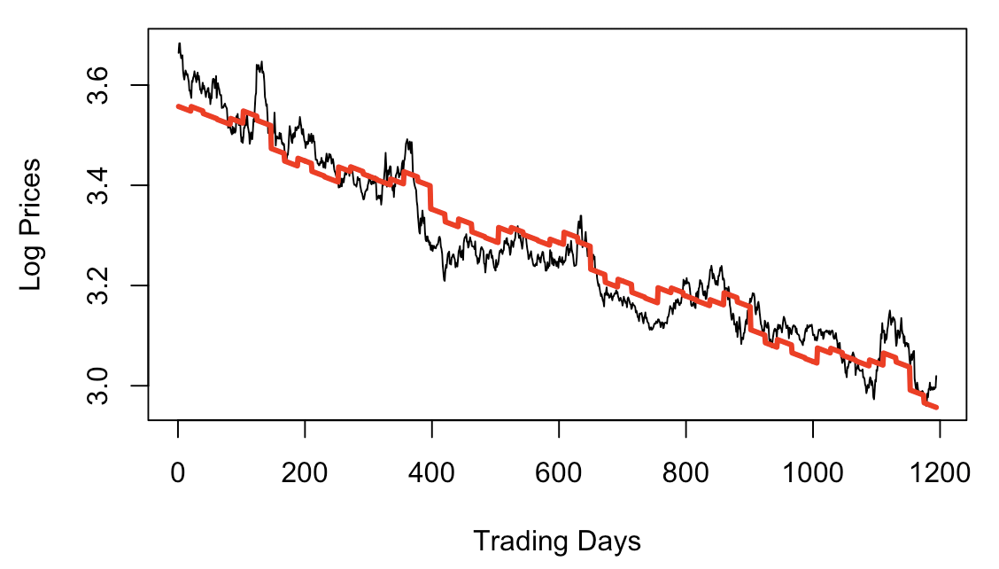
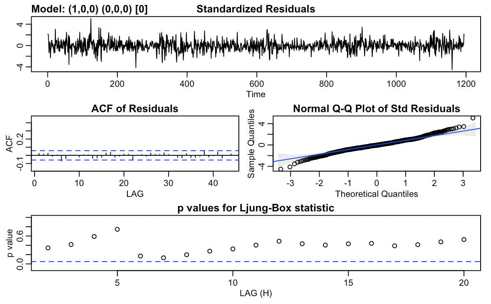
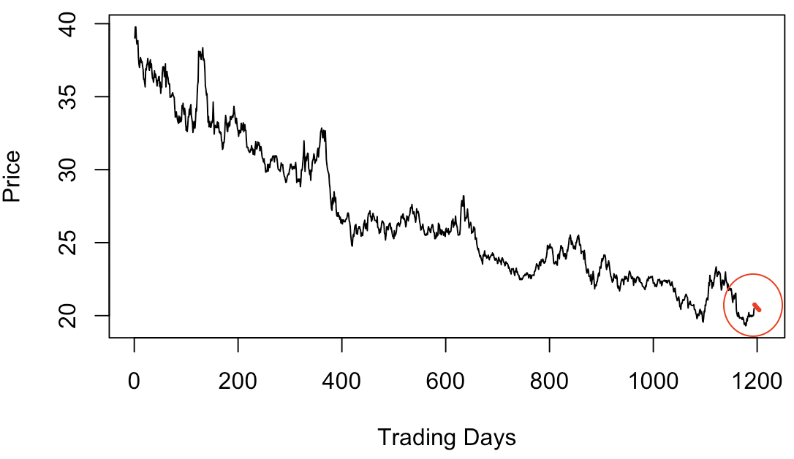

## Dataset and background:
Mediocre Social Network Apps Incorporated wanted to get forecasts of the stock price of their company for the next 10 trading days following September 30th, 2019. In order to predict we have used daily stock price data starting from January 2nd, 2015. The predictions should serve as a realistic estimate on how the company will do in the fourth quarter if nothing changes. 

## Our Model
Taking the natural log of the company’s stock price, we get a roughly linearly decreasing pattern. We also noticed that the stock prices seem to fluctuate periodically indicating a seasonal component. So we decided to do a linear fit of the Log Stock Prices on the

number of trading days since January 2nd, 2015: a numeric representation of the date
indicator variables for the month: for example, the indicator variable for February will be 1 if the stock price is from the month of February, and 0 otherwise

The linear model -  plotted in red - with the log-transformed data is shown in figure 1 below. From this plot, we can see that the linear model fits the data relatively well since the model is following the data quite closely.

However, the residuals of the linear model were not completely stationary, so we decided to further model the residuals to get a stationary process. After looking at the auto-correlations (ACF)  and the partial correlation coefficients (PACF) of the residuals, we decided to model them as an auto-regressive process of lag 1: AR(1). The graphs below in figure 2 shows residuals of the model’s linear fit after it has been modeled as an auto-regressive process of lag 1. The ACF of the residuals of the AR(1) process (not to be confused with the residuals of the linear fit) shows no significant auto-correlations. This shows that an AR(1) process is a good model for the residuals of the linear fit. The high p-values of the Ljung-Box statistic also confirm the validity of the model.

Our final prediction is a combination of the predictions of the linear model and the predictions for the residuals of the linear model. The sum of these two predictions gives us the predicted value for the Log of Stock Price. We take its exponential to the predicted Stock Price. Our predictions, in red, are plotted with the original data. 

 
## Conclusions and interpretations: 
Based on the predictions our model produced, the stock price for Mediocre Social Network Apps Incorporated is predicted to continually decrease in line with general trends. Those holding stocks at Mediocre Social Network Apps Incorporated should consider selling their stocks before it declines further.

Mediocre Social Network Apps Incorporated should also look into new marketing strategies and/or discuss with consulting firms to help change the company since the overall trend of their stock prices is still decreasing. 
